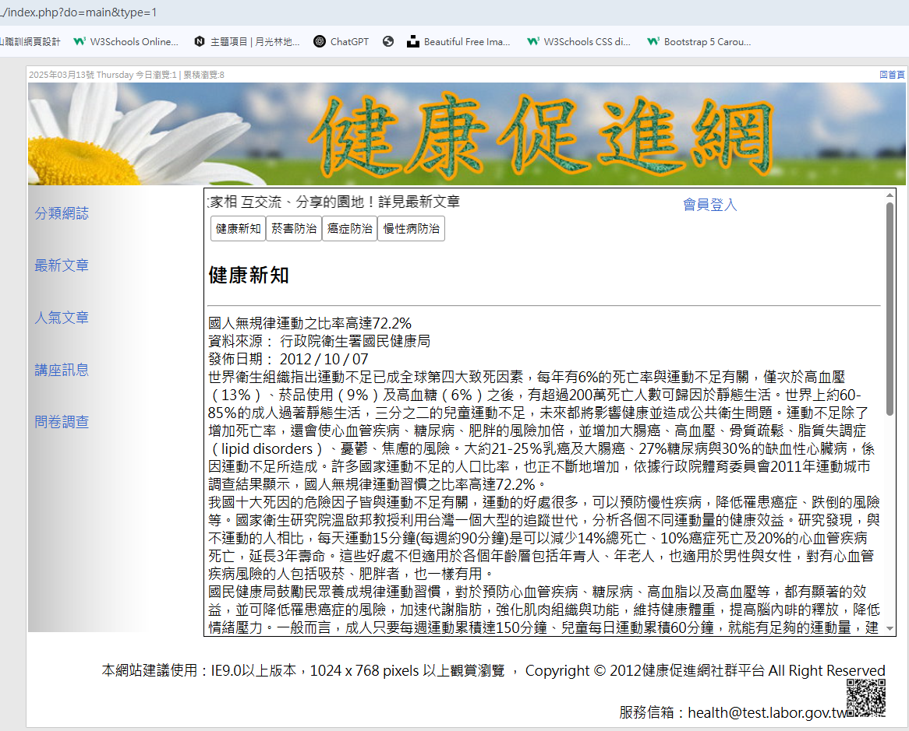

## 乙級02題心得


### 簡化api/db.php內的session(瀏覽人數)的代碼

- 原始代碼:
```php
// 如果沒有
if(!isset($_SESSION['total'])){
    // 如果有今天的紀錄
    if($Total->count(['date'=>date("Y-m-d")])>0){
    $total=$Total->find(['date'=>date("Y-m-d")]);
        $total['total']++;
        $Total->save($total);
        // 如果沒有今天的紀錄
    }else{
        $Total->save(['date'=>date("Y-m-d"),'total'=>1]);
    }
    $_SESSION['total']=1;
}
```
修改過後的代碼:
```php
if(!isset($_SESSION['total'])){
    // 新增變數today把date裝進去
    $todey=date("Y-m-d");
    // 設變數$chk直接去find
    $chk=$Total->find(['date'=>$todey]);
    if($chk){
        // 找到資料走這條
        $chk['total']++;
        $Total->save($chk);
    }else{
        // 沒有資料走這條
        $Total->save(['total'=>1,'date'=>$todey]);
    }
    $_SESSION['total']=1;
}
```

### 修改front/main.php 跟po.php的代碼

- 因為這兩個版都長很像 所以我是先在資料庫建好資料再從資料庫撈資料出來
- 原始代碼:main.php
```css 
css
.types {
    display: flex;
    margin-left: 1px;

}

.type {
    border: 1px solid #999;
    padding: 5px 10px;
    margin-left: -1px;
    margin-bottom: -1px;
    cursor: pointer;
    background-color: #eee;

}

.type.active {
    background-color: white;
    border-bottom: #eee;
}

.text {
    width: 100%;
    min-height: 450px;
    border: 1px solid #999;
    display: none;
    /* background */
}

.active {
    display: block;
}
```

```html
php
<div style="width:96%;margin:auto;">
    <div class="types">

        <div class="type active">健康新知</div>
        <div class="type">菸害防治</div>
        <div class="type">癌症防治</div>
        <div class="type">慢性病防治</div>
    </div>
    <div class="texts">
        <div class="text active">
        ...文字資料    
        </div>
         <div class="text">
        ...文字資料    
        </div>
        ......
```
```js 
js
$(".type").on('click', function() {
    let idx = $(this).index();
    $(".text").removeClass("active");
    $(".text").eq(idx).addClass('active');
    $(".type").removeClass("active");
    $(this).addClass('active');
})
```
- 而我是資料表news多增加一個欄位 type_id
- type_id   int  填入1-4
- type 改成 text 如果資料的type_id=1則填入 健康新知 以此類推
- 修改過後的代碼:main.php
```css 
css
.btn{
    margin-right: -7px;
}
```
```html 
php
    <!-- 多設一個get參數:type -->
<a href="?do=main&type=1"><button class="btn">健康新知</button></a>
<a href="?do=main&type=2"><button class="btn">菸害防治</button></a>
<a href="?do=main&type=3"><button class="btn">癌症防治</button></a>
<a href="?do=main&type=4"><button class="btn">慢性病防治</button></a>
<?php
<!-- 如果$_GET['type']有值 -->
    if(isset($_GET['type'])){
        <!-- 就去抓type_id=$_GET['type']的資料 -->
    $row=$News->find(['type_id'=>$_GET['type']])
    ?>

<div>
    <h2>
        <!-- 撈出 type:健康新知那些 -->
        <?=$row['type']?>
    </h2>
    <hr>
    </div>
    <div>
        
        <?=nl2br($row['text']);?>
    </div>
    <?php
    }
    ?>
```
展示:



- po.php的代碼

```css 
css
```
```php
php
```
```js 
js
```